# Jarkom-Modul-2-ITB02-2022

Anggota kelompok:

1. Asima Prima Yohana Tampubolon - 5027201009
2. Cherylene Trevina - 5027201033
3. Fatih Rian Hibatul Hakim - 5027201066

## Daftar Isi:

* [Bentuk Topologi](#bentuk-topologi)
* [Nomor 1](#nomor-1) & [Jawaban](#jawaban1)
* [Nomor 2](#nomor-2) & [Jawaban](#jawaban2)
* [Nomor 3](#nomor-3) & [Jawaban](#jawaban3)
* [Nomor 4](#nomor-4) & [Jawaban](#jawaban4)
* [Nomor 5](#nomor-5) & [Jawaban](#jawaban5)
* [Nomor 6](#nomor-6) & [Jawaban](#jawaban6)
* [Nomor 7](#nomor-7) & [Jawaban](#jawaban7)
* [Nomor 8](#nomor-8) & [Jawaban](#jawaban9)
* [Nomor 9](#nomor-9) & [Jawaban](#jawaban9)
* [Nomor 10](#nomor-10) & [Jawaban](#jawaban10)
* [Nomor 11](#nomor-11) & [Jawaban](#jawaban11)
* [Nomor 12](#nomor-12) & [Jawaban](#jawaban12)
* [Nomor 13](#nomor-13) & [Jawaban](#jawaban13)
* [Nomor 14](#nomor-14) & [Jawaban](#jawaban14)
* [Nomor 15](#nomor-15) & [Jawaban](#jawaban15)
* [Nomor 16](#nomor-16) & [Jawaban](#jawaban16)
* [Nomor 17](#nomor-17) & [Jawaban](#jawaban17)

## Bentuk Topologi

Berikut adalah topologi yang kami gunakan:

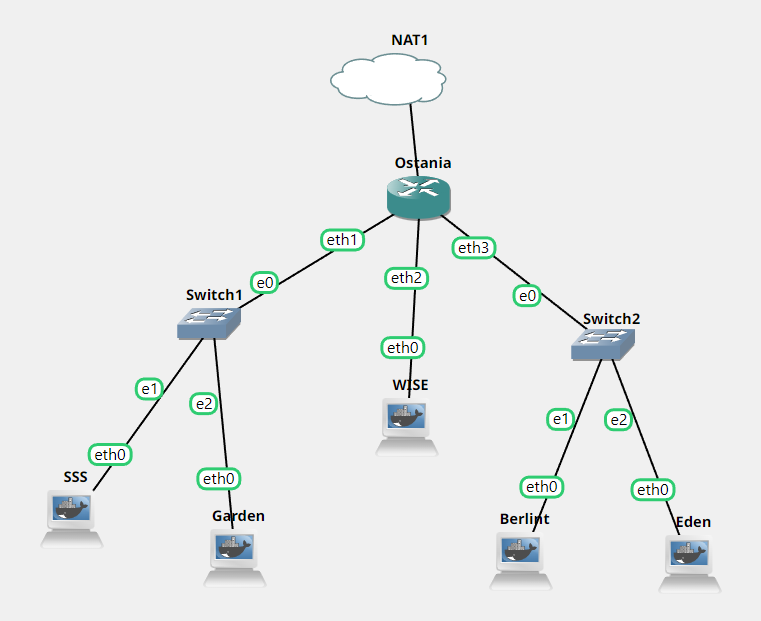

## Nomor 1

WISE akan dijadikan sebagai DNS Master, Berlint akan dijadikan DNS Slave, dan Eden akan digunakan sebagai Web Server. Terdapat 2 Client yaitu SSS, dan Garden. Semua node terhubung pada router Ostania, sehingga dapat mengakses internet (1).

## Jawaban1

Konfigurasi masing-masing node dalam topologi:

Ostania

```sh
auto eth0
iface eth0 inet dhcp

auto eth1
iface eth1 inet static
    address 192.215.1.1
    netmask 255.255.255.0

auto eth2
iface eth2 inet static
    address 192.215.2.1
    netmask 255.255.255.0

auto eth3
iface eth3 inet static
    address 192.215.3.1
    netmask 255.255.255.0
```

SSS

```sh
auto eth0
iface eth0 inet static
    address 192.215.1.2
    netmask 255.255.255.0
    gateway 192.215.1.1
```

Garden

```sh
auto eth0
iface eth0 inet static
    address 192.215.1.3
    netmask 255.255.255.0
    gateway 192.215.1.1
```

WISE

```sh
auto eth0
iface eth0 inet static
    address 192.215.2.2
    netmask 255.255.255.0
    gateway 192.215.3.1
```

Berlint

```sh
auto eth0
iface eth0 inet static
    address 192.215.3.2
    netmask 255.255.255.0
    gateway 192.215.3.1
```

Eden

```sh
auto eth0
iface eth0 inet static
    address 192.215.3.3
    netmask 255.255.255.0
    gateway 192.215.3.1
```

Selanjutnya, pada **Ostania**, dijalankan command berikut:

```sh
iptables -t nat -A POSTROUTING -o eth0 -j MASQUERADE -s 192.215.0.0/16
```

Mencari IP DNS dari **Ostania** menggunakan command: `cat /etc/resolv.conf` dengan IP DNS yang didapatkan:

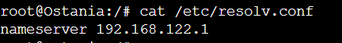

Memasukkan command `echo nameserver 192.168.122.1 > /etc/resolv.conf` **di setiap node** agar terhubung ke DNS Ostania.

### Testing1

Hasil percobaan ping google.com:

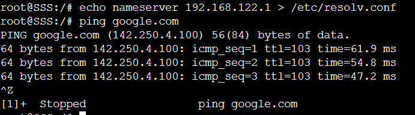

## Nomor 2

Untuk mempermudah mendapatkan informasi mengenai misi dari Handler, bantulah Loid membuat website utama dengan akses wise.yyy.com dengan alias www.wise.yyy.com pada folder wise (2).

## Jawaban2

Karena WISE merupakan DNS Master, maka konfigurasi dilakukan di node **WISE**. Pertama-tama kami membuat domainnya terlebih dahulu pada **WISE** setelah itu ditambahkan konfigurasi untuk CNAME.

```sh
apt-get update
apt-get install bind9 -y
```

Selanjutnya, konfigurasi zone pada `/etc/bind/named.conf.local`

```sh
//
// Do any local configuration here
//
 
// Consider adding the 1918 zones here, if they are not used in your
// organization
//include "/etc/bind/zones.rfc1918";
zone "wise.itb02.com" {
        type master;
        file "/etc/bind/wise/wise.itb02.com";
};
```

Lalu, buat folder bernama **WISE** pada `/etc/bind/` dengan menggunakan command `mkdir -p /etc/bind/wise`. Selanjutnya copy file `db.local` dengan command `cp /etc/bind/db.local /etc/bind/wise/wise.itb02.com`.

Selanjutnya, melakukan konfigurasi pada `/etc/bind/wise/wise.itb02.com`

```sh
;
; BIND data file for local loopback interface
;
$TTL    604800
@       IN      SOA     wise.itb02.com. root.wise.itb02.com. (
                        20221025        ; Serial
                         604800         ; Refresh
                          86400         ; Retry
                        2419200         ; Expire
                         604800 )       ; Negative Cache TTL
;
@       IN      NS      wise.itb02.com.
@       IN      A       192.215.2.2
www    IN      CNAME   wise.itb02.com.
@       IN      AAAA    ::1
```

Selanjutnya restart bind9 dengan menggunakan command `service bind9 restart`.

### Testing2

Selanjutnya, melakukan testing pada client **SSS** dan **Garden**:

1. Menyambungkan IP WISE ke dalam client `echo nameserver 192.215.2.2 > /etc/resolv.conf`
2. Melakukan testing dengan command `ping www.wise.itb02.com`

Hasil:
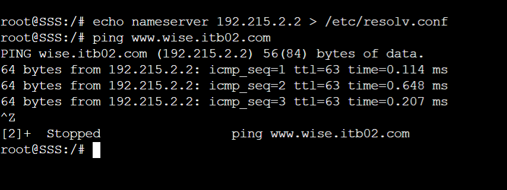

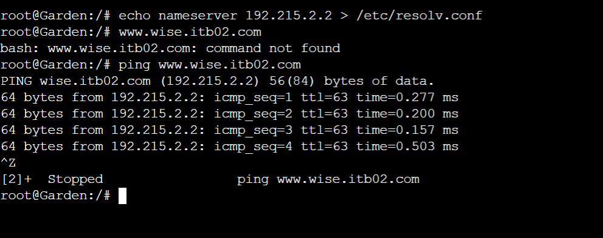

## Nomor 3

Setelah itu ia juga ingin membuat subdomain eden.wise.yyy.com dengan alias www.eden.wise.yyy.com yang diatur DNS-nya di WISE dan mengarah ke Eden (3).

## Jawaban3

Untuk soal nomor 3, diperlukan pembuatan subdomain & CNAME sekaligus untuk penyelesaian soal. Pertama-tama, mengubah konfigurasi pada node **WISE** pada file `/etc/bind/wise/wise.itb02.com`

```sh
;
; BIND data file for local loopback interface
;
$TTL    604800
@       IN      SOA     wise.itb02.com. root.wise.itb02.com. (
                        20221025        ; Serial
                         604800         ; Refresh
                          86400         ; Retry
                        2419200         ; Expire
                         604800 )       ; Negative Cache TTL
;
@               IN      NS      wise.itb02.com.
@               IN      A       192.215.2.2
www             IN      CNAME   wise.itb02.com.
@               IN      AAAA    ::1
eden            IN      A       192.215.3.3
www.eden        IN      CNAME   eden.wise.itb02.com.
```

Selanjutnya restart bind9 dengan menggunakan command `service bind9 restart`.

### Testing3

Selanjutnya, melakukan testing pada client **SSS** dan **Garden**:

1. Menyambungkan IP WISE ke dalam client `echo nameserver 192.215.2.2 > /etc/resolv.conf`
2. Melakukan testing dengan command `ping www.eden.wise.itb02.com` dan `ping eden.wise.itb02.com`

Hasil:
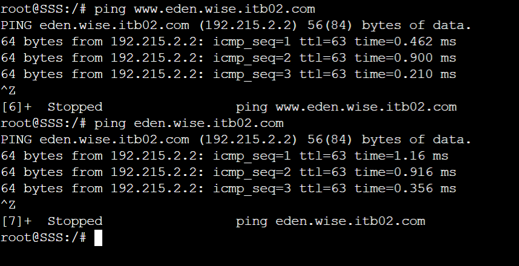

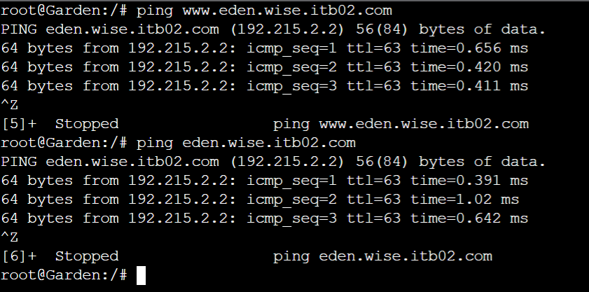

## Nomor 4

Buat juga reverse domain untuk domain utama (4).

## Jawaban4

Untuk pembuatan reverse DNS, dilakukan konfigurasi berikut pada **WISE** file `/etc/bind/named.conf.local`.

```sh
//
// Do any local configuration here
//
 
// Consider adding the 1918 zones here, if they are not used in your
// organization
//include "/etc/bind/zones.rfc1918";
zone "wise.itb02.com" {
        type master;
        file "/etc/bind/wise/wise.itb02.com";
};
zone "2.215.192.in-addr.arpa" {
    type master;
    file "/etc/bind/wise/2.215.192.in-addr.arpa";
};
```

Selanjutnya, copy file `etc/bind/db.local` pada `/etc/bind/wise/2.215.192.in-addr.arpa`, selanjutnya melakukan konfigurasi berikut:

```sh
;
; BIND data file for local loopback interface
;
$TTL    604800
@       IN      SOA     wise.itb02.com. root.wise.itb02.com. (
                        20221025        ; Serial
                         604800         ; Refresh
                          86400         ; Retry
                        2419200         ; Expire
                         604800 )       ; Negative Cache TTL
;
2.215.192.in-addr.arpa. IN      NS      wise.itb02.com.
2                       IN      PTR     wise.itb02.com.
```

Selanjutnya restart bind9 dengan menggunakan command `service bind9 restart`.

### Testing4

Selanjutnya, melakukan testing pada client **SSS** dan **Garden**:

1. Install dnsutils
    * Mengembalikan ke IP DNS agar terhubung ke internet `echo nameserver 192.168.122.1 > /etc/resolv.conf`
    * `apt-get update`
    * `apt-get install dnsutils -y`

2. Menghubungkan kembali ke IP WISE `echo nameserver 192.215.2.2 > /etc/resolv.conf`
3. Melakukan testing dengan command `host -t PTR 192.215.2.2`.

Hasil:
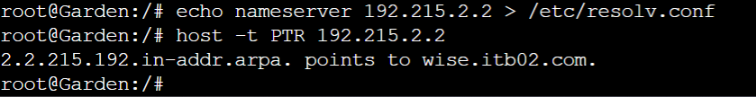

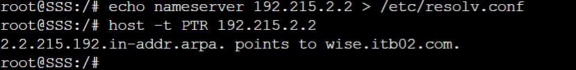

## Nomor 5

Agar dapat tetap dihubungi jika server WISE bermasalah, buatlah juga Berlint sebagai DNS Slave untuk domain utama (5).

## Jawaban5

Untuk pembuatan DNS slave, kita buat konfigurasi di **WISE** terlebih dahulu.
`nano /etc/bind/named.conf.local`

```
//
// Do any local configuration here
//
 
// Consider adding the 1918 zones here, if they are not used in your
// organization
//include "/etc/bind/zones.rfc1918";
zone "wise.itb02.com" {
    type master;
    notify yes;
    also-notify { 192.215.3.2; };
    allow-transfer { 192.215.3.2; };
    file "/etc/bind/wise/wise.itb02.com";
};
zone "2.215.192.in-addr.arpa" {
    type master;
    file "/etc/bind/wise/2.215.192.in-addr.arpa";
};
```

Selanjutnya restart bind9 dengan menggunakan command `service bind9 restart`.

Setelah itu, kita lakukan konfigurasi DNS slave pada **Berlint** di dalam folder `/etc/bind/named.conf.local`.

```
//
// Do any local configuration here
//
 
// Consider adding the 1918 zones here, if they are not used in your
// organization
//include "/etc/bind/zones.rfc1918";
zone "wise.itb02.com" {
    type slave;
    masters { 192.215.2.2; };
    file "/var/lib/bind/wise.itb02.com";
};
```
Selanjutnya restart bind9 dengan menggunakan command `service bind9 restart`.

### Testing5

Selanjutnya, melakukan testing pada client **SSS** dan **Garden**:

1. Menambahkan nameserver pada **SSS** dan **Garden** `echo nameserver 192.215.2.2 > /etc/resolv.conf` dan `echo nameserver 192.215.3.2 > /etc/resolv.conf`
2. Melakukan testing dengan command `ping wise.itb02.com` dan `ping wise.itb02.com`

Hasil:

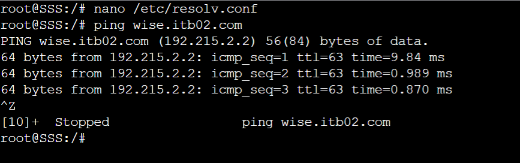

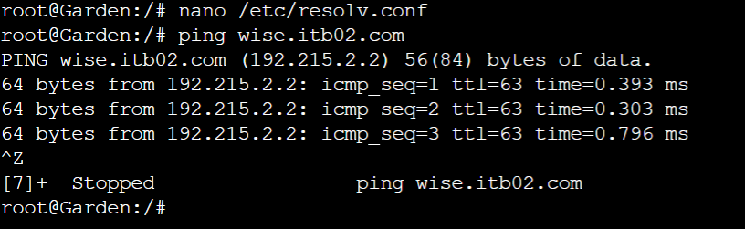

## Nomor 6

Karena banyak informasi dari Handler, buatlah subdomain yang khusus untuk operation yaitu operation.wise.yyy.com dengan alias www.operation.wise.yyy.com yang didelegasikan dari WISE ke Berlint dengan IP menuju ke Eden dalam folder operation (6).

## Jawaban6

Pertama sekali kita kita edit konfigurasi terlebih dahulu di **WISE** dengan menjalankan command `nano /etc/bind/wise/wise.itb02.com`

```
;
; BIND data file for local loopback interface
;
$TTL    604800
@       IN      SOA     wise.itb02.com. root.wise.itb02.com. (
                        20221025        ; Serial
                         604800         ; Refresh
                          86400         ; Retry
                        2419200         ; Expire
                         604800 )       ; Negative Cache TTL
;
@               IN      NS      wise.itb02.com.
@               IN      A       192.215.2.2
www             IN      CNAME   wise.itb02.com.
@               IN      AAAA    ::1
eden            IN      A       192.215.3.3    
www.eden        IN      CNAME   eden.wise.itb02.com.
ns1             IN      A       192.215.3.2
operation       IN      NS      ns1 
```

Lalu, kita jalankan `nano /etc/bind/named.conf.options` pada **WISE** untuk mengedit beberapa options.

```
options {
        directory "/var/cache/bind";
 
        // If there is a firewall between you and nameservers you want
        // to talk to, you may need to fix the firewall to allow multiple
        // ports to talk.  See http://www.kb.cert.org/vuls/id/800113
 
        // If your ISP provided one or more IP addresses for stable
        // nameservers, you probably want to use them as forwarders.
        // Uncomment the following block, and insert the addresses replacing
        // the all-0s placeholder.
       
        // forwarders {
        //      0.0.0.0;
        // };
       
        //=====================================================================$
        // If BIND logs error messages about the root key being expired,
        // you will need to update your keys.  See https://www.isc.org/bind-keys
        //=====================================================================$
        //dnssec-validation auto;
        allow-query{any;};
 
        auth-nxdomain no;    # conform to RFC1035
        listen-on-v6 { any; };
};
```

Yang diedit adalah:

1. Komen `dnssec-validation auto;`

2. allow-query{any;};

Lalu pada **Berlint** kita melakukan edit konfigurasi dengan menjalankan command `nano /etc/bind/named.conf.local` terlebih dahulu.

```
//
// Do any local configuration here
//
 
// Consider adding the 1918 zones here, if they are not used in your
// organization
//include "/etc/bind/zones.rfc1918";
zone "wise.itb02.com" {
    type slave;
    masters { 192.215.2.2; };
    file "/var/lib/bind/wise.itb02.com";
};
 
zone "operation.wise.itb02.com" {
        type master;
        file "/etc/bind/operation/operation.wise.itb02.com";
};
```
Lalu, kita membuat folder operation `nano /etc/bind/named.conf.options` dan mengedit file optionsnya `nano /etc/bind/named.conf.options`.

```
options {
        directory "/var/cache/bind";
 
        // If there is a firewall between you and nameservers you want
        // to talk to, you may need to fix the firewall to allow multiple
        // ports to talk.  See http://www.kb.cert.org/vuls/id/800113
 
        // If your ISP provided one or more IP addresses for stable
        // nameservers, you probably want to use them as forwarders.
        // Uncomment the following block, and insert the addresses replacing
        // the all-0's placeholder.
       
        // forwarders {
        //      0.0.0.0;
        // };
       
        //=====================================================================$
        // If BIND logs error messages about the root key being expired,
        // you will need to update your keys.  See https://www.isc.org/bind-keys
        //=====================================================================$
        //dnssec-validation auto;
        allow-query{any;};
 
        auth-nxdomain no;    # conform to RFC1035
        listen-on-v6 { any; };
};
```
Yang diedit adalah:

1. Komen `dnssec-validation auto;`

2. allow-query{any;};

Setelah itu, kita copy db.local ke dalam operation.wise.itb02.com `cp /etc/bind/db.local /etc/bind/operation/operation.wise.itb02.com`

Lalu edit menggunakan command `nano /etc/bind/operation/operation.wise.itb02.com`.

```
;
; BIND data file for local loopback interface
;
$TTL    604800
@       IN      SOA     operation.wise.itb02.com. root.operation.wise.itb02.com. (
                        20221025        ; Serial
                         604800         ; Refresh
                          86400         ; Retry
                        2419200         ; Expire
                         604800 )       ; Negative Cache TTL
;
@       IN      NS      operation.wise.itb02.com.
@       IN      A       192.215.3.3
www     IN      CNAME   operation.wise.itb02.com.
@       IN      AAAA    ::1
```

Selanjutnya, kita melakukan restart bind9 `service bind9 restart`.

### Testing6

Selanjutnya, melakukan testing pada client **SSS** dan **Garden**:

Melakukan testing dengan command `ping www.operation.wise.itb02.com` dan `ping operation.wise.itb02.com`

Hasil:


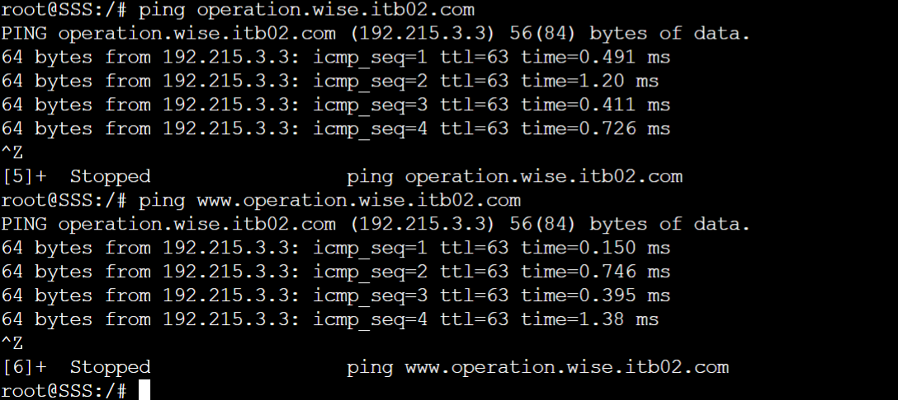


## Nomor 7

Untuk informasi yang lebih spesifik mengenai Operation Strix, buatlah subdomain melalui Berlint dengan akses strix.operation.wise.yyy.com dengan alias www.strix.operation.wise.yyy.com yang mengarah ke Eden (7).

## Jawaban7

abc

## Nomor 8

Setelah melakukan konfigurasi server, maka dilakukan konfigurasi Webserver. Pertama dengan webserver www.wise.yyy.com. Pertama, Loid membutuhkan webserver dengan DocumentRoot pada /var/www/wise.yyy.com (8).

## Jawaban8

abc

## Nomor 9

Setelah itu, Loid juga membutuhkan agar url www.wise.yyy.com/index.php/home dapat menjadi menjadi www.wise.yyy.com/home (9).

## Jawaban9

abc

## Nomor 10

Setelah itu, pada subdomain www.eden.wise.yyy.com, Loid membutuhkan penyimpanan aset yang memiliki DocumentRoot pada /var/www/eden.wise.yyy.com (10).

## Jawaban10

abc

## Nomor 11

Akan tetapi, pada folder /public, Loid ingin hanya dapat melakukan directory listing saja (11).

## Jawaban11

abc

## Nomor 12

Tidak hanya itu, Loid juga ingin menyiapkan error file 404.html pada folder /error untuk mengganti error kode pada apache (12).

## Jawaban12

abc

## Nomor 13

Loid juga meminta Franky untuk dibuatkan konfigurasi virtual host. Virtual host ini bertujuan untuk dapat mengakses file asset www.eden.wise.yyy.com/public/js menjadi www.eden.wise.yyy.com/js (13).

## Jawaban13

abc

## Nomor 14

Loid meminta agar www.strix.operation.wise.yyy.com hanya bisa diakses dengan port 15000 dan port 15500 (14)

## Jawaban14

abc

## Nomor 15

dengan autentikasi username Twilight dan password opStrix dan file di /var/www/strix.operation.wise.yyy (15)

## Jawaban15

abc

## Nomor 16

dan setiap kali mengakses IP Eden akan dialihkan secara otomatis ke www.wise.yyy.com (16).

## Jawaban16

abc

## Nomor 17

Karena website www.eden.wise.yyy.com semakin banyak pengunjung dan banyak modifikasi sehingga banyak gambar-gambar yang random, maka Loid ingin mengubah request gambar yang memiliki substring “eden” akan diarahkan menuju eden.png. Bantulah Agent Twilight dan Organisasi WISE menjaga perdamaian! (17)

## Jawaban17

abc
